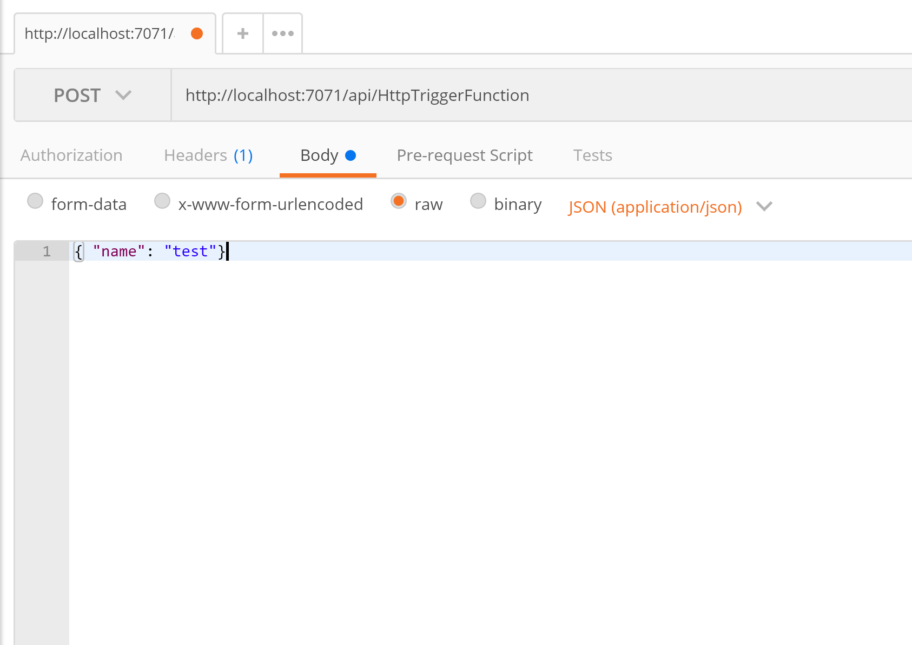

# 1. Create Azure functions in Azure Portal
In this section we will create first a Function app which will contain the following Azure functions:

1. A Http trigger function that process an Http post message and sends it through a queue storage.
2. A Queue trigger function that reads from a queue and save the content of the queue message to a nosql storage.


## Create Azure functions with Visual studio
 Requirements:
 
 - Visual Studio 2017
 - Install Azure Functions and Web Jobs Tools sdk
 - Azure Functions cli

1. Create in Visual studio a new project with the same Azure Functions previously created in Azure Portal.

2. Install Azure Function cli tools

```C#
npm install -g azure-functions-core-tools@core
```

3. Fetch the Azure Functions AppSettings and store it locally

```C#
az login

func azure functionapp fetch-app-settings <your_functionapp_name>
```

4. Fetch the Azure Functions ConnectionString and store it locally

```C#
az login

func azure storage fetch-connection-string <your_storage_name>
```
5. Right-click in your Azure function and select debug

6. Post a Http call with, for instance, Postman


