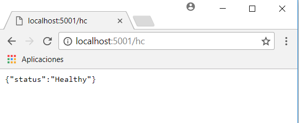
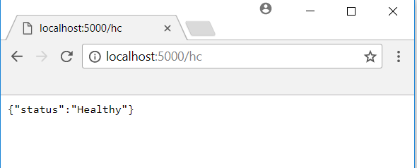
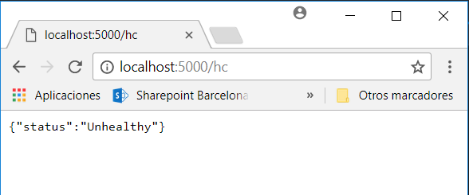

# Adding HealthChecks to Master and Slave services
In this section we will add the HealthChecks library implemented by the AspNet team. You can use for instance the branch `6-docker-machine`. At the end of this section we will have a similar health check code to the one in the branch `7-resilience`. First we have to install the NuGet package Microsoft.AspNetCore.HealthChecks in both Slave and Master projects.
## Slave project
For the Slave project we need to ensure that the service is up and running. You can add a simple endpoint that answers an OK status if the application is running. Follow the next steps:
1. Add in the Program.cs the extension method `UseHealthChecks("string path")` to create the endpoint for the HealthChecks monitoring:

```C#
public static IWebHost BuildWebHost(string[] args) =>
    WebHost.CreateDefaultBuilder(args)
        .UseStartup<Startup>()
        .UseHealthChecks("/hc")
        .Build();
```

2. Once we have created the endpoint, we configure the checks needed to ensure that the service is up and running. Since Slave has no other dependencies and it is a very simple service, we can just send an OK status. We add the configuration of the health check to the `ConfigureServices()` method:

```C#
public void ConfigureServices(IServiceCollection services)
{
    services.AddSingleton<GuidProvider>();
    services.AddHealthChecks(checks =>
    {
        // cache to zero only for demo/testing purposes, do not put zero otherwise
        checks.AddValueTaskCheck("HTTP Endpoint",
        () => new ValueTask<IHealthCheckResult>(HealthCheckResult.Healthy("Ok")),
        TimeSpan.Zero);
    });
    services.AddMvc();
}
```
The method accepts a function `Func<ValueTask<IHealthCheckResult>>`. In this case we directly answer the OK status, because we do not need to check anything more, but if required some checks could be done.

3. Run the projects, open the browser and go to `http://localhost:5001/hc`. You should see the response of the Health Check monitoring service, in this case 'Healthy':



## Master project
For the Master project it is not only important to ensure that the service is up and running, but to ensure that its dependencies, in this case the Slave service, is working as well. In case that, for any reason, Master cannot reach the Slave service, we must set the state of the Master as 'unhealthy':
1. Add in the Program.cs the extension method `UseHealthChecks("string path")` to create the endpoint for the HealthChecks monitoring:

```C#
public static IWebHost BuildWebHost(string[] args) =>
    WebHost.CreateDefaultBuilder(args)
        .UseStartup<Startup>()
        .UseHealthChecks("/hc")
        .Build();
```

2. Once we have created the endpoint, we configure the check. In this case as said we need to add the dependency to the Slave service. A call to its health check endpoint will do the job. We add the configuration of the health checks to the `ConfigureServices()` method:

```C#
public void ConfigureServices(IServiceCollection services)
{
    services.AddSingleton<GuidProvider>();
    services.AddOptions();
    services.Configure<MySettings>(Configuration.GetSection("MasterSettings"));
    services.AddHealthChecks(checks =>
    {
        // Cache to zero only for demo/testing purposes, do not put zero otherwise
        checks.AddUrlCheck($"{Configuration["MasterSettings:SlaveUri"]}/hc", TimeSpan.Zero);
    });
    services.AddMvc();
}
```
As you ca see we use an extension method, 'AddUrlCheck' to test the health check end point of the slave service, that we have set to `/hc` in the step 1.

3. Run the projects, open the browser and go to `http://localhost:5000/hc`. You should see the response of the Health Check monitoring service, in this case 'Healthy':



4. Now stop the container that is running the Slave service. Execute in the cmd `docker stop <id of the container>` to stop the container. Then open in the browser the uri `http://localhost:5000/hc`. You will see the status as 'Unhealthy' since the Slave service is down.



Because the Slave, a dependency of Master is down, the Master service shows unhealthy status. Note that the change of state has been instantly, due to the fact that the cache of the check is set to zero. Normally the time of the cache has to be hight (for HealthCheck by default is 5 minutes) in order to avoid to stress our services with a big load of healh check calls.