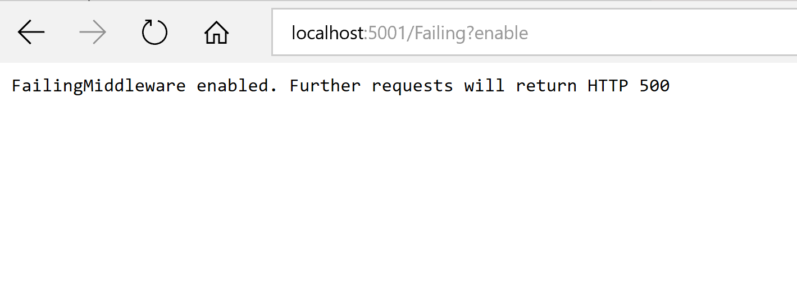
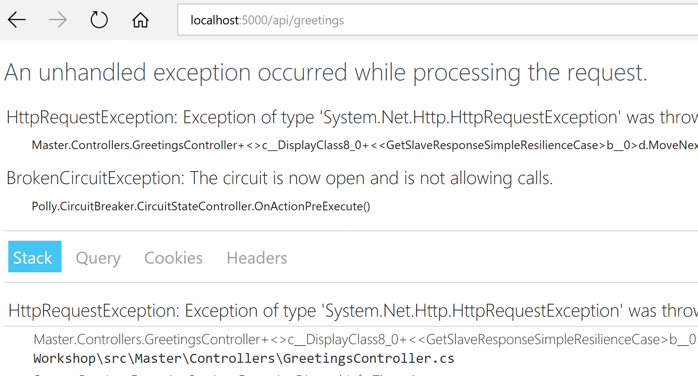
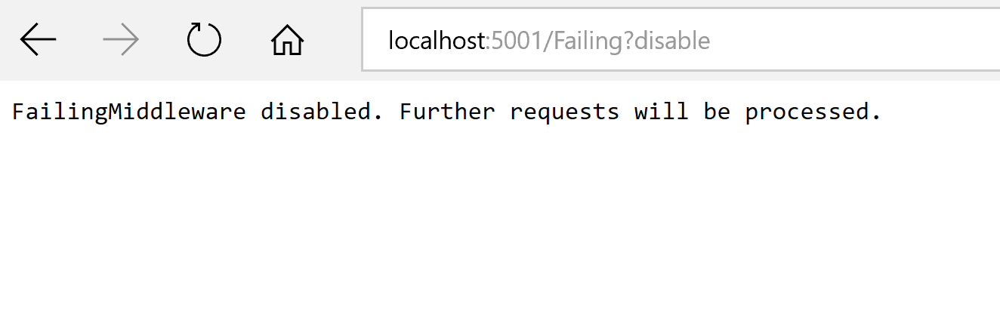
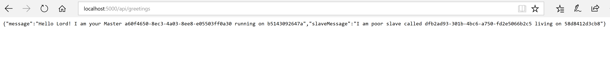

# Adding Polly circuit breaker abd retry policies to Master service
In this section we will add the the circuit breaker and retry policies using the Polly library. First we have to install the NuGet package Polly in Master project.
## Slave project
 Follow the next steps:
1. Add in the Program.cs the extension method `UseFailing("string path")` to create the endpoint for simulating a service failure:

```C#
public static IWebHost BuildWebHost(string[] args) =>
            WebHost.CreateDefaultBuilder(args)
                .UseFailing(options =>
                {
                    options.ConfigPath = "/Failing";
                })
                .UseStartup<Startup>()
                .UseHealthChecks("/hc")
                .Build();
```

2. Activate failure mode in Slace service by hitting the following url:



## Master project
 Implement an Http invoker in the GreetingsController which will apply the Polly retry and circuit breaker policies when calling the Slave service
 Follow the next steps:

```C#
private async Task<string> GetSlaveResponseSimpleResilienceCase()
        {
            using (var client = new HttpClient())
            {
                return await HttpInvoker(async () =>
                {
                    var requestMessage = new HttpRequestMessage(HttpMethod.Get, $"{_cfg.SlaveUri}/api/identification");

                    var response = await client.SendAsync(requestMessage);

                    // raise exception if HttpResponseCode 500 
                    // needed for circuit breaker to track fails

                    if (response.StatusCode == HttpStatusCode.InternalServerError)
                    {
                        throw new HttpRequestException();
                    }

                    return await response.Content.ReadAsStringAsync();
                });
            }
        }

private async Task<T> HttpInvoker<T>(Func<Task<T>> action)
        {
            var masterPolicies = _policiesFactory.Policies();
            var policyWrap = Policy.WrapAsync(masterPolicies);

            // Executes the action applying all 
            // the policies defined in the wrapper
            return await policyWrap.ExecuteAsync(action);
        }      
```

Launch the Master service and hit the following url to make the call to the Slave service and test the policies.



As shown above, after several retries the circuit will be opened and an exception will appear displaying a CircuitBroken exception.

Disable again the Failure middleware in Slave service by hitting the following url:



Check that you can make requests successfully again
Wait a moment and hit the following url again:


